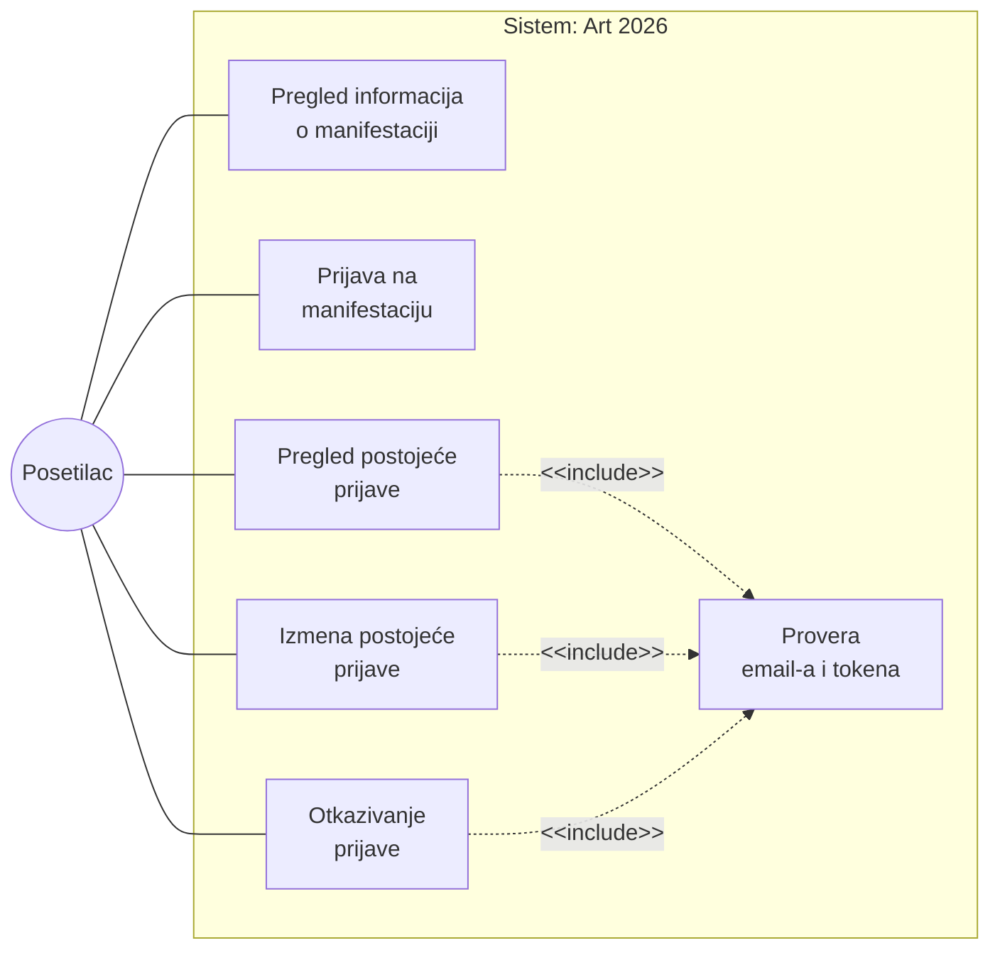
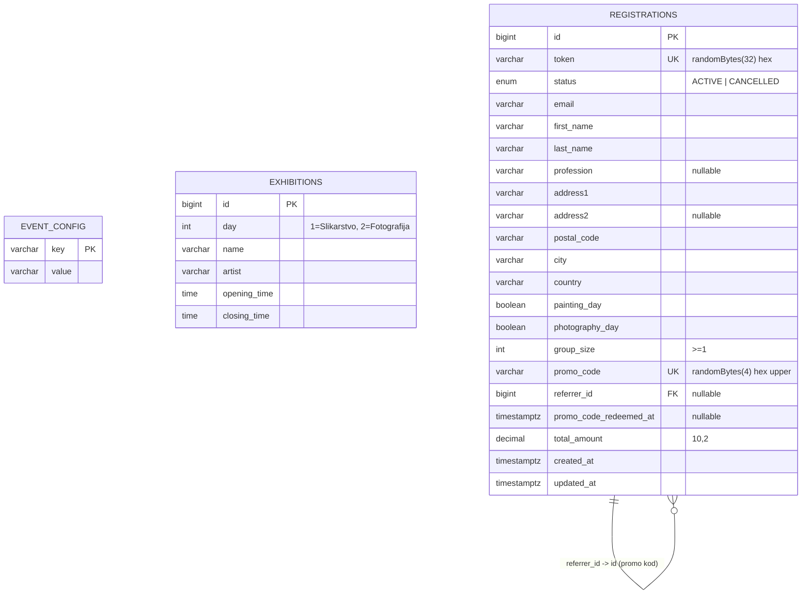
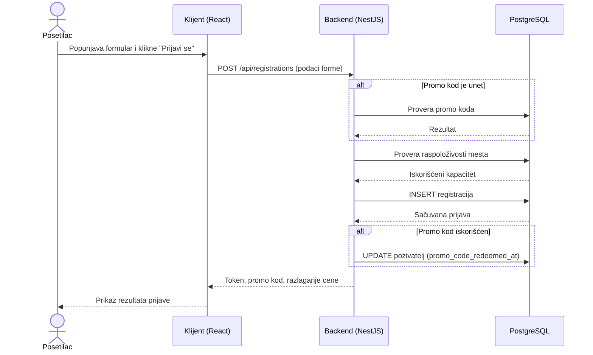
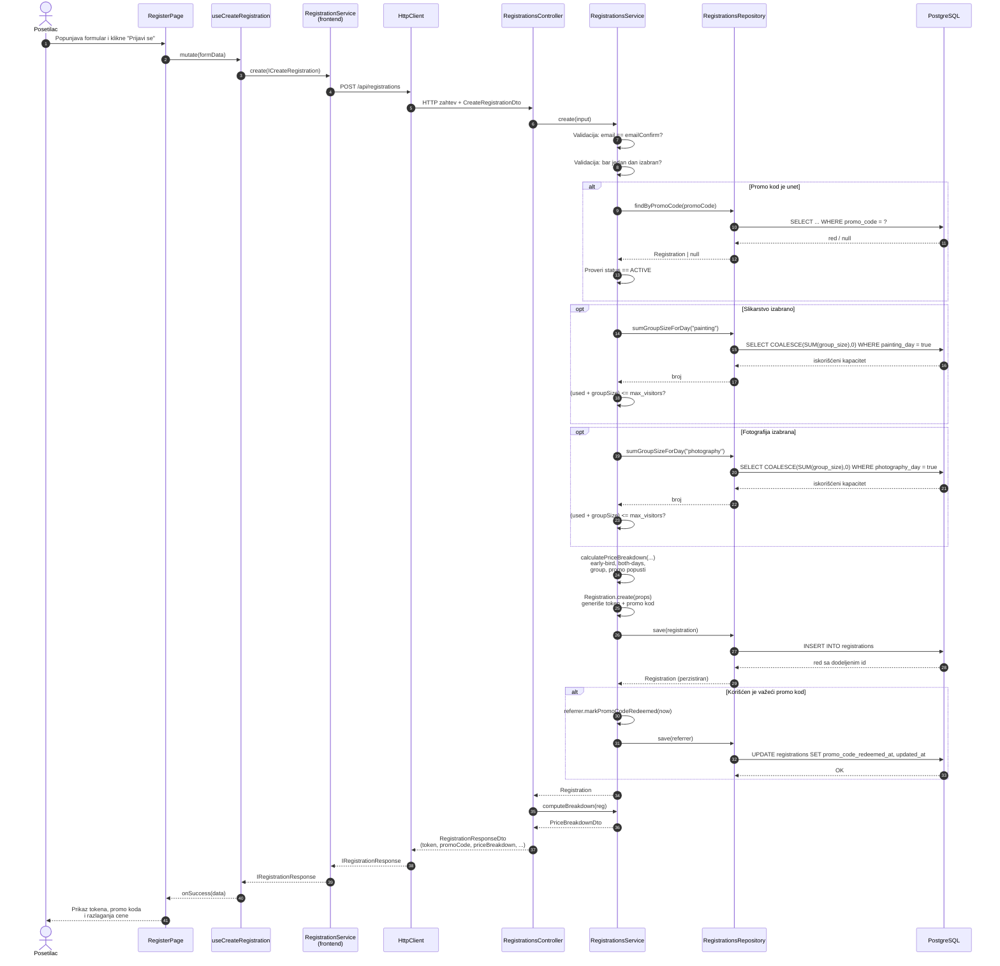
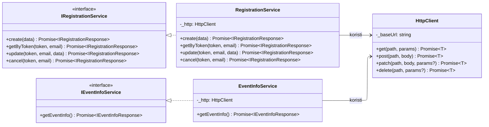

# Art 2026

Veb aplikacija za upravljanje prijavama na kulturnu manifestaciju "Art 2026". Manifestacija se održava tokom dva dana u Domu kulture Studentski grad u Beogradu: prvog dana, u subotu 16.05.2026, izloženi su radovi iz oblasti slikarstva, dok su drugog dana, u nedelju 17.05.2026, izloženi radovi iz oblasti fotografije. Aplikacija posetiocima omogućava pregled informacija o manifestaciji, prijavu za jedan ili oba dana, naknadnu izmenu prijave i njeno otkazivanje. Pristup prijavama je kontrolisan uređenim parom (email, token), tako da nije potrebno kreiranje korisničkog naloga.

---

## Sadržaj

1. [Kako pokrenuti](#1-kako-pokrenuti)
2. [Softverski zahtevi](#2-softverski-zahtevi)
3. [Dijagram slučajeva korišćenja](#3-dijagram-slučajeva-korišćenja)
4. [Logički PMOV model podataka](#4-logički-pmov-model-podataka)
5. [Dijagram sekvenci za Funkcionalnost 2 – Prijava na manifestaciju](#5-dijagram-sekvenci-za-funkcionalnost-2--prijava-na-manifestaciju)
6. [Konačni dijagram klasa](#6-konačni-dijagram-klasa)
7. [Struktura projekta](#7-struktura-projekta)
8. [Arhitekturna pravila](#8-arhitekturna-pravila)

---

## 1. Kako pokrenuti

### Preduslovi

- Docker 24+ i Docker Compose v2
- Node.js 20+ i npm 10+ (samo za lokalno pokretanje van kontejnera)

### Pokretanje putem Docker Compose (preporučeno)

Iz root direktorijuma projekta:

```bash
docker compose up
```

Docker Compose podiže tri servisa: `app` (NestJS backend + Vite frontend, u istom kontejneru pokrenuti kroz `concurrently`), `postgres` (baza podataka) i `pgadmin` (veb interfejs za administraciju baze).

| Servis         | Adresa                    | Napomena                                 |
| -------------- | ------------------------- | ---------------------------------------- |
| Web (frontend) | http://localhost:5173     | React + Vite dev server                  |
| API (backend)  | http://localhost:3001/api | NestJS aplikacija                        |
| pgAdmin        | http://localhost:5050     | Korisničko ime `admin`, lozinka `admin`  |
| PostgreSQL     | localhost:5432            | Korisničko ime `art2026`, baza `art2026` |

Prilikom prvog podizanja NestJS automatski kreira šemu baze (`ORM_SYNC=true`) i popunjava tabele `event_config` i `exhibitions` podrazumevanim vrednostima.

### Alternativno: lokalno pokretanje van kontejnera

Ako se koristi lokalna Node.js instalacija, dovoljno je pokrenuti samo bazu podataka kroz Docker:

```bash
docker compose up -d postgres
npm install
npm run start:dev
```

Skripta `start:dev` istovremeno pokreće `shared` paket u `watch` režimu, NestJS backend i Vite dev server (kroz `concurrently`).

### Generisanje PDF dokumentacije

Ceo README (uključujući Mermaid dijagrame) može se eksportovati u PDF:

```bash
npm run docs:pdf
```

Skripta koristi `md-to-pdf` koji prikazuje Mermaid dijagrame pomoću Puppeteer-a.

---

## 2. Softverski zahtevi

Aplikacija je organizovana oko četiri glavne funkcionalnosti. Svaka funkcionalnost odgovara jednom ili više endpoint-a na backend-u i jednoj ili više stranica na frontend-u.

### Funkcionalnost 1 — Informacije o manifestaciji

Posetilac otvara početnu stranicu aplikacije i vidi sve javno dostupne informacije o manifestaciji. Podaci se agregiraju iz tri izvora u okviru servisa `EventInfoService`:

- **Osnovni podaci o manifestaciji** (naziv, grad, mesto održavanja, datumi oba dana, cene po danu, rok za early-bird popust, dodatne napomene) čitaju se iz tabele `event_config`.
- **Prikaz izložbi** čita se iz tabele `exhibitions`, grupisano po danu: Dan 1 (Slikarstvo) i Dan 2 (Fotografija). Za svaku postavku prikazuju se naziv, umetnik, vreme početka i vreme završetka.
- **Broj slobodnih mesta po danu** računa se kao `max_visitors − Σ group_size` po danu, uzimajući u obzir isključivo prijave sa statusom `ACTIVE`.

REST endpoint: `GET /api/event-info`. Sve informacije se dopremaju jednim zahtevom, čime se izbegava potreba za više HTTP povratnih ciklusa na strani klijenta.

### Funkcionalnost 2 — Prijava na manifestaciju

Posetilac otvara stranicu `/register`, popunjava formular i podnosi prijavu. Formular obuhvata sledeće grupe polja:

- **Lični podaci:** ime, prezime, profesija (opciono), adresa (linija 1, opciona linija 2), poštanski broj, mesto, država.
- **Kontakt:** email adresa i potvrda email adrese.
- **Izbor dana:** slikarstvo, fotografija, ili oba dana. Bar jedan dan mora biti izabran.
- **Veličina grupe:** ceo broj ≥ 1. Predstavlja broj osoba koje se prijavljuju pod istom prijavom.
- **Promo kod:** opcioni kod druge prijave. Ako je unet, mora biti validan (postoji u sistemu) i pripadati aktivnoj prijavi. (Napomena. frontend odmah prikazuje popust tokom popunjavanja (bez potvrde servera), ali će server vratiti grešku prilikom podnošenja prijave ako je kod nevalidan)

Cena se izračunava u trenutku slanja i skladišti u polju `total_amount`. Formula obuhvata više faza u obračunu popusta:

1. **Early-bird popust (10%)** — primenjuje se na cenu svakog dana ako je trenutni datum pre `early_bird_deadline` (podrazumevana vrednost 30.04.2026). Efektivne cene: `C1eff = C1 · 0.9`, `C2eff = C2 · 0.9`.
2. **Podzbir po osobi (dnevni)** — u zavisnosti od izbora dana:
   - Samo slikarstvo: `C1eff`
   - Samo fotografija: `C2eff`
   - Oba dana: `(C1eff + C2eff) · 0.9` (dodatnih 10% popusta na kombinaciju).
3. **Grupni popust** — primenjuje se na `podzbir · group_size`:
   - `group_size = 3` → 3%
   - `group_size ≥ 5` → 5%
   - inače → 0%
4. **Promo popust (5%)** — ako je uz prijavu korišćen važeći promo kod druge aktivne prijave, primenjuje se dodatnih 5% na iznos nakon grupnog popusta.

Konačni iznos:

```
total = ((day_subtotal · group_size) · (1 − group_discount)) · (1 − promo_discount)
```

Pre čuvanja prijave, servis dodatno proverava dostupnost mesta po svakom izabranom danu (`sumGroupSizeForDay + group_size ≤ max_visitors`). Prijava koja bi premašila kapacitet biva odbijena.

Nakon uspešne prijave sistem generiše:

- **Token** — 64-znakovni heksadecimalni string (`randomBytes(32)`), predstavlja trajan pristupni ključ i vraća se posetiocu.
- **Promo kod** — 8-znakovni heksadecimalni string velikim slovima (`randomBytes(4)`), koji posetilac može podeliti drugima.

REST endpoint: `POST /api/registrations`.

### Funkcionalnost 3 — Izmena prijave

Posetilac otvara stranicu `/manage`, unosi email adresu i token, i time pristupa detaljnom prikazu svoje prijave na ruti `/manage/:token`. Backend proverava da li token postoji i da li se email poklapa; ako ne, odgovor je `403 Forbidden`, odnosno `404 Not Found`.

Nad aktivnom prijavom moguće su sledeće izmene:

- Dodavanje ili uklanjanje jednog dana (uz očuvanje uslova da bar jedan dan mora ostati izabran).
- Promena veličine grupe (uvećanje ili smanjenje).

Za svaku izmenu koja povećava kapacitet (dodavanje dana ili uvećanje grupe) sistem ponovo proverava raspoloživa mesta, izuzimajući tekuću prijavu iz sume. Nakon izmene cena se ponovo računa i upisuje u `total_amount`. Otkazana prijava (`status = CANCELLED`) ne može se izmeniti.

REST endpoint: `PATCH /api/registrations/:token?email=...`.

### Funkcionalnost 4 — Otkazivanje prijave

Sa detaljne stranice prijave posetilac može trajno otkazati prijavu. Sistem proverava par (token, email), postavlja status na `CANCELLED` i snima izmenu. Pošto se kod provere promo koda uzimaju u obzir samo aktivne prijave, promo kod otkazane prijave automatski gubi važnost. Token se ne rotira niti reaktivira — otkazana prijava je trajno neaktivna.

REST endpoint: `DELETE /api/registrations/:token?email=...`.

### Pregled endpoint-a

| Metoda | Ruta                        | Query / Body                       | Opis                                                               |
| ------ | --------------------------- | ---------------------------------- | ------------------------------------------------------------------ |
| GET    | `/api/event-info`           | —                                  | Vraća konfiguraciju, listu izložbi i broj slobodnih mesta po danu. |
| POST   | `/api/registrations`        | `CreateRegistrationDto`            | Kreira prijavu, vraća token, promo kod i razlaganje cene.          |
| GET    | `/api/registrations/:token` | `?email=`                          | Vraća prijavu ako se email poklapa.                                |
| PATCH  | `/api/registrations/:token` | `UpdateRegistrationDto`, `?email=` | Menja dane i/ili veličinu grupe, ponovo računa cenu.               |
| DELETE | `/api/registrations/:token` | `?email=`                          | Otkazuje prijavu (status `CANCELLED`).                             |

---

## 3. Dijagram slučajeva korišćenja

Dijagram prikazuje aktera (Posetilac) i četiri osnovna slučaja korišćenja aplikacije. Slučajevi "Izmena prijave", "Otkazivanje prijave" i "Pregled prijave" u sebi sadrže zajednički slučaj "Provera email-a i tokena", modelovan `<<include>>` relacijom, jer zahtevaju istu autentifikacionu proveru pre nego što se izvrši osnovna radnja.



<p class="fig-caption">Dijagram 1 – UML dijagram slučajeva korišćenja</p>

### Opis slučajeva korišćenja

**UC1 — Pregled informacija o manifestaciji.** Posetilac otvara početnu stranicu aplikacije. Sistem preuzima aktuelnu konfiguraciju (naziv, mesto, datume, cene, dodatne napomene), listu izložbi grupisanih po danima i broj slobodnih mesta po danu. Rezultat se prikazuje kao jedinstvena celina. Preduslov: nema. Glavni tok završava se prikazom stranice sa aktivnim CTA dugmadima za prijavu i za pristup postojećoj prijavi.

**UC2 — Prijava na manifestaciju.** Posetilac popunjava registracioni formular (lični podaci, izbor dana, veličina grupe i eventualno promo kod). Sistem validira ulaz (poklapanje email adresa, validnost promo koda), proverava dostupnost mesta za sve izabrane dane, izračunava cenu prema definisanoj formuli, generiše token i promo kod, i snima prijavu. Ako je korišćen promo kod, na prijavi pozivaoca postavlja se vremenska oznaka iskorišćenja. Rezultat: posetilac dobija token, promo kod i razlaganje cene.

**UC3 — Pregled postojeće prijave.** Uključuje UC6. Nakon uspešne provere email-a i tokena, sistem prikazuje detaljni pregled prijave: lični podaci, izabrani dani, promo kod i razlaganje cene. Posetilac može pregledati prijavu bez ikakvih izmena.

**UC4 — Izmena postojeće prijave.** Uključuje UC6. Nakon uspešne provere email-a i tokena, posetilac može dodati ili ukloniti dan i promeniti veličinu grupe. Sistem ponovo proverava raspoloživost mesta i ponovo računa cenu. Otkazana prijava se ne može izmeniti.

**UC5 — Otkazivanje prijave.** Uključuje UC6. Nakon uspešne provere sistem postavlja status prijave na `CANCELLED`. Time promo kod prijave prestaje da važi (jer provera koda uzima u obzir samo aktivne prijave). Ista prijava se ne može ponovo aktivirati.

**UC6 — Provera email-a i tokena.** Sistem preuzima prijavu po tokenu iz rute i upoređuje email iz upita sa email-om zapisanim na prijavi (bez razlikovanja velikih i malih slova). Ako prijava ne postoji, vraća se `404 Not Found`; ako se email ne poklapa, `403 Forbidden`.

---

## 4. Logički PMOV model podataka

ER dijagram prikazuje tri entiteta koje aplikacija koristi: `event_config` (v u obliku ključ/vrednost), `exhibitions` (postavke po danu) i `registrations` (prijave posetilaca). Entitet `registrations` je samoreferencirajući: kolona `referrer_id` pokazuje na `id` prijave čiji je promo kod iskorišćen prilikom kreiranja referencirane prijave.



<p class="fig-caption">Dijagram 2 – Logički PMOV model podataka</p>

### Objašnjenje entiteta i veza

**`event_config`.** Tabela ključ/vrednost koja čuva parametre manifestacije: naziv, grad, mesto održavanja, datume oba dana, cene po danu, rok za early-bird popust, maksimalan broj posetilaca po danu i dodatne informacije. Vrednosti se čitaju kao stringovi i po potrebi konvertuju u broj ili datum na aplikativnom sloju. Tabela se popunjava automatski prilikom prvog pokretanja (`EventConfigService.onModuleInit`).

**`exhibitions`.** Sadrži listu izložbi (postavki) po danu. Kolona `day` je enumeracija tipa `EventDay` (`1 = Slikarstvo`, `2 = Fotografija`). Za svaku postavku čuvaju se naziv, umetnik i vreme početka/završetka. I ova tabela se popunjava automatski pri prvom pokretanju.

**`registrations`.** Centralna tabela sistema. Svaka prijava ima jedinstven `token` (koristi se kao pristupni ključ) i jedinstven `promo_code` (koji vlasnik prijave može podeliti drugima). Polja `painting_day` i `photography_day` uz ograničenje "bar jedno mora biti `true`" definišu za koje dane važi prijava. `group_size` pokazuje koliko osoba pokriva prijava (kapacitet po danu tretira se u toj granulaciji). `total_amount` je unapred izračunat iznos, izračunat po formuli opisanoj u Funkcionalnost 2 i osvežen pri svakoj izmeni. `status` može biti `ACTIVE` ili `CANCELLED`; otkazivanje je jednosmerna operacija.

**Veza `REGISTRATIONS → REGISTRATIONS`.** Samoreferencirajuća 1:N relacija (identifikovana stranim ključem `referrer_id`) modeluje mehanizam promo kodova. Ako je prijava B pri kreiranju upotrebila promo kod prijave A, tada `B.referrer_id = A.id`. Na prijavi A se u istoj transakciji postavlja `promo_code_redeemed_at` na trenutno vreme (nije jedinstven — u trenutnoj verziji jedna prijava može biti pozivalac za više novih prijava, s tim što se u polju čuva vreme poslednjeg iskorišćenja). Ako je prijava A otkazana, njen promo kod prestaje da važi za nove prijave, jer provera pri kreiranju traži isključivo prijave sa statusom `ACTIVE`.

---

## 5. Dijagram sekvenci za Funkcionalnost 2 – Prijava na manifestaciju

### 5.1. Pregled na višem nivou apstrakcije

Tok izvršavanja prikazan sa četiri učesnika: posetilac, klijent (React), server (NestJS) i baza podataka.



<p class="fig-caption">Dijagram 3 – Dijagram sekvenci: pregled na višem nivou apstrakcije</p>

### 5.2. Prikaz po arhitekturalnim slojevima

Tok izvršavanja kroz sve slojeve sistema, od trenutka kada posetilac klikne dugme "Prijavi se" na formi, kroz frontend hook i HTTP sloj, sve do NestJS servisa, TypeORM repozitorijuma i PostgreSQL baze. Prikazane su i grane u kojima se validira promo kod, proverava raspoloživost mesta, izračunava cena i, ako je korišćen promo kod, ažurira pozivateljeva prijava.



<p class="fig-caption">Dijagram 4 – Dijagram sekvenci: prikaz po arhitekturalnim slojevima</p>

---

## 6. Dijagrami klasa

Prikazani su tipovi veza: nasleđivanje (Entity ← Registration, TypeOrmRepository ← RegistrationsTypeOrmRepository), realizacija interfejsa (`IRegistrationsRepository` ← `RegistrationsTypeOrmRepository`) i zavisnosti kroz kompoziciju (npr. `RegistrationsService` zavisi od `IRegistrationsRepository` i `EventConfigService`). Radi preglednosti, backend i frontend su prikazani u odvojenim dijagramima.

### 6.1. Backend (NestJS)

```mermaid
%%{init: {'layout': 'elk'}}%%
classDiagram
    direction LR

    %% ==== Domain ====
    class Entity {
        <<abstract>>
        +id: TId
    }

    class Registration {
        -_id: number
        -_token: string
        -_status: RegistrationStatus
        -_email: string
        -_firstName: string
        -_lastName: string
        -_profession: string
        -_address1: string
        -_address2: string
        -_postalCode: string
        -_city: string
        -_country: string
        -_paintingDay: boolean
        -_photographyDay: boolean
        -_groupSize: number
        -_promoCode: string
        -_referrerId: number
        -_promoCodeRedeemedAt: Date
        -_totalAmount: number
        -_createdAt: Date
        -_updatedAt: Date
        +static create(props) Registration
        +static reconstitute(props) Registration
        +updateDays(painting, photography) void
        +updateGroupSize(size) void
        +updateTotalAmount(amount) void
        +cancel() void
        +markPromoCodeRedeemed(at) void
    }

    class Exhibition {
        -_id: number
        -_day: EventDay
        -_name: string
        -_artist: string
        -_openingTime: string
        -_closingTime: string
        +static create(props) Exhibition
        +static reconstitute(props) Exhibition
    }

    class EventConfig {
        -_key: string
        -_value: string
        +key: string
        +value: string
        +setValue(value) void
        +static create(props) EventConfig
        +static reconstitute(props) EventConfig
    }

    class IRegistrationsRepository {
        <<interface>>
        +save(reg) Promise~Registration~
        +findByToken(token) Promise~Registration~
        +findByPromoCode(code) Promise~Registration~
        +sumGroupSizeForDay(day, excludeId) Promise~number~
    }

    class IExhibitionsRepository {
        <<interface>>
        +save(ex) Promise~Exhibition~
        +findAll() Promise~Exhibition[]~
        +count() Promise~number~
    }

    class IEventConfigRepository {
        <<interface>>
        +save(cfg) Promise~EventConfig~
        +findAll() Promise~EventConfig[]~
        +findByKey(key) Promise~EventConfig~
        +count() Promise~number~
    }

    %% ==== Application ====
    class RegistrationsService {
        -_repository: IRegistrationsRepository
        -_config: EventConfigService
        +create(input) Promise~Registration~
        +findByTokenAndEmail(token, email) Promise~Registration~
        +update(token, email, input) Promise~Registration~
        +cancel(token, email) Promise~Registration~
        +computeBreakdown(reg) Promise~PriceBreakdownDto~
        +getFreeSpots() Promise~object~
    }

    class EventConfigService {
        -_repository: IEventConfigRepository
        +onModuleInit() Promise~void~
        +getAll() Promise~Record~
        +getByKey(key) Promise~string~
    }

    class ExhibitionsService {
        -_repository: IExhibitionsRepository
        +onModuleInit() Promise~void~
        +getAll() Promise~Exhibition[]~
    }

    class EventInfoService {
        -_config: EventConfigService
        -_exhibitions: ExhibitionsService
        -_registrations: RegistrationsService
        +getEventInfo() Promise~IEventInfoResponse~
    }

    class PriceBreakdownDto {
        +basePricePerPerson: number
        +earlyBirdDiscount: number
        +bothDaysDiscount: number
        +groupDiscount: number
        +promoDiscount: number
        +totalAmount: number
    }

    class calculatePriceBreakdown {
        <<function>>
        +(input) PriceBreakdownDto
    }

    %% ==== Infrastructure ====
    class TypeOrmRepository {
        <<abstract>>
        #_dataSource: DataSource
        #_mapper: TypeOrmMapper
        +save(entity) Promise~T~
        +findAll() Promise~T[]~
        +count() Promise~number~
        #findOneWhere(where) Promise~T~
    }

    class RegistrationsTypeOrmRepository {
        +findByToken(token) Promise~Registration~
        +findByPromoCode(code) Promise~Registration~
        +sumGroupSizeForDay(day, excludeId) Promise~number~
    }

    class ExhibitionsTypeOrmRepository {
        +findAll() Promise~Exhibition[]~
    }

    class EventConfigTypeOrmRepository {
        +findByKey(key) Promise~EventConfig~
    }

    class RegistrationTypeOrmMapper {
        +toDomain(p) Registration
        +toPersistence(d) RegistrationPersistence
    }

    class ExhibitionTypeOrmMapper {
        +toDomain(p) Exhibition
        +toPersistence(d) ExhibitionPersistence
    }

    class EventConfigTypeOrmMapper {
        +toDomain(p) EventConfig
        +toPersistence(d) EventConfigPersistence
    }

    %% ==== Presentation ====
    class RegistrationsController {
        -_service: RegistrationsService
        +create(dto) Promise~RegistrationResponseDto~
        +findByToken(token, email) Promise~RegistrationResponseDto~
        +update(token, email, dto) Promise~RegistrationResponseDto~
        +cancel(token, email) Promise~RegistrationResponseDto~
    }

    class EventInfoController {
        -_service: EventInfoService
        +get() Promise~IEventInfoResponse~
    }

    class RegistrationResponseDto {
        +id: number
        +token: string
        +status: RegistrationStatus
        +email: string
        +... : ...
        +priceBreakdown: IPriceBreakdown
        +static from(reg, breakdown) RegistrationResponseDto
    }

    %% ==== Nasleđivanje ====
    Entity <|-- Registration
    Entity <|-- Exhibition
    Entity <|-- EventConfig
    TypeOrmRepository <|-- RegistrationsTypeOrmRepository
    TypeOrmRepository <|-- ExhibitionsTypeOrmRepository
    TypeOrmRepository <|-- EventConfigTypeOrmRepository

    %% ==== Realizacija interfejsa ====
    IRegistrationsRepository <|.. RegistrationsTypeOrmRepository
    IExhibitionsRepository <|.. ExhibitionsTypeOrmRepository
    IEventConfigRepository <|.. EventConfigTypeOrmRepository

    %% ==== Zavisnosti ====
    RegistrationsService --> IRegistrationsRepository : koristi
    RegistrationsService --> EventConfigService : koristi
    RegistrationsService ..> calculatePriceBreakdown : poziva
    RegistrationsService ..> PriceBreakdownDto : vraća
    EventConfigService --> IEventConfigRepository : koristi
    ExhibitionsService --> IExhibitionsRepository : koristi
    EventInfoService --> EventConfigService : koristi
    EventInfoService --> ExhibitionsService : koristi
    EventInfoService --> RegistrationsService : koristi

    RegistrationsTypeOrmRepository --> RegistrationTypeOrmMapper : koristi
    ExhibitionsTypeOrmRepository --> ExhibitionTypeOrmMapper : koristi
    EventConfigTypeOrmRepository --> EventConfigTypeOrmMapper : koristi

    RegistrationsController --> RegistrationsService : koristi
    RegistrationsController ..> RegistrationResponseDto : vraća
    EventInfoController --> EventInfoService : koristi
```



<p class="fig-caption">Dijagram 5 – Konačni dijagram klasa: Backend (NestJS)</p>

### 6.2. Frontend (React)



<p class="fig-caption">Dijagram 6 – Konačni dijagram klasa: Frontend (React)</p>

---

## 7. Struktura projekta

Repozitorijum je organizovan kao npm workspaces monorepo. Backend i frontend dele tipske ugovore preko internog paketa `@art-2026/shared`.

```
art-2026/
├── apps/
│   ├── server/                             # NestJS backend (port 3001)
│   │   └── src/
│   │       ├── app.module.ts
│   │       ├── main.ts
│   │       ├── env.validation.ts
│   │       ├── core/
│   │       │   ├── event-config/
│   │       │   │   ├── domain/             # EventConfig entity, IEventConfigRepository
│   │       │   │   ├── application/        # EventConfigService (seed + getters)
│   │       │   │   ├── infrastructure/     # TypeORM entity, repo, mapper
│   │       │   │   └── event-config.module.ts
│   │       │   ├── exhibitions/
│   │       │   │   ├── domain/             # Exhibition entity, IExhibitionsRepository
│   │       │   │   ├── application/        # ExhibitionsService (seed + getAll)
│   │       │   │   ├── infrastructure/     # TypeORM entity, repo, mapper
│   │       │   │   ├── presentation/rest/  # ExhibitionsController
│   │       │   │   └── exhibitions.module.ts
│   │       │   ├── registrations/
│   │       │   │   ├── domain/             # Registration entity, IRegistrationsRepository
│   │       │   │   ├── application/        # RegistrationsService, PriceBreakdownDto
│   │       │   │   ├── infrastructure/     # TypeORM entity, repo, mapper
│   │       │   │   ├── presentation/rest/  # RegistrationsController + DTOs
│   │       │   │   └── registrations.module.ts
│   │       │   └── event-info/
│   │       │       ├── application/        # EventInfoService (agregacija)
│   │       │       ├── presentation/rest/  # EventInfoController
│   │       │       └── event-info.module.ts
│   │       └── shared/
│   │           ├── domain/                 # Entity, IRepository
│   │           ├── application/            # Mapper abstract
│   │           └── infrastructure/         # TypeOrmRepository, TypeOrmMapper
│   │
│   └── web/                                # React + Vite frontend (port 5173)
│       └── src/
│           ├── main.tsx
│           ├── app/
│           │   ├── app-providers.tsx       # ServiceContainer + QueryClient + Toaster
│           │   ├── router.tsx              # React Router konfiguracija
│           │   └── service-container.ts    # DI kontejner (React context)
│           ├── features/
│           │   ├── event-info/
│           │   │   ├── domain/             # IEventInfoService
│           │   │   ├── infrastructure/     # EventInfoService (HTTP)
│           │   │   ├── application/        # useEventInfo hook (TanStack Query)
│           │   │   └── presentation/       # EventInfoPage, ExhibitionsGrid
│           │   └── registrations/
│           │       ├── domain/             # IRegistrationService
│           │       ├── infrastructure/     # RegistrationService (HTTP)
│           │       ├── application/        # useCreateRegistration, useRegistration,
│           │       │                       # useUpdateRegistration, useCancelRegistration
│           │       └── presentation/       # RegisterPage, ManagePage,
│           │                               # RegistrationDetailPage,
│           │                               # RegistrationForm, EditRegistrationForm,
│           │                               # PriceSummary
│           ├── components/ui/              # shadcn/ui komponente
│           └── shared/
│               ├── infrastructure/http/    # HttpClient, HttpError
│               └── presentation/lib/       # utils (cn helper)
│
├── shared/                                  # @art-2026/shared
│   └── src/
│       ├── enums/
│       │   ├── registration-status.enum.ts  # ACTIVE | CANCELLED
│       │   └── event-day.enum.ts            # PAINTING = 1 | PHOTOGRAPHY = 2
│       ├── interfaces/
│       │   ├── event-info.interface.ts
│       │   ├── exhibition.interface.ts
│       │   ├── registration.interface.ts    # ICreateRegistration, IUpdateRegistration,
│       │   │                                # IRegistrationResponse
│       │   └── price-breakdown.interface.ts # IPriceBreakdown
│       └── index.ts
│
├── docker-compose.yaml
├── Dockerfile
├── package.json                             # npm workspaces root
├── package-lock.json
└── README.md                                # Ovaj dokument
```

---

## 8. Arhitekturna pravila

Arhitektura koja se prožima i kroz backend i kroz frontend organizoana je u četiri sloja (domenski, aplikacioni, infrastrukturni i prezentacioni). Arhitekrura zahteva da zavisnosti između slojeva teku isključivo prema unutra (ka domenskom sloju), što je direktna primena Dependency Inversion principa. Zapravo, ovaj primer bi se mogao okarakterisati kao kombinacija arhitekturalnog obrasca Feature-Slice i arhitekture podeljenje u četiri sloja.

Da bi arhitektura ostala konzistentna, pravila zavisnosti između slojeva su automatizovano proveravana pomoću `eslint-plugin-boundaries` (`apps/server/eslint.config.js` i `apps/web/eslint.config.js`). Ovaj pristup je inspirisan organizacijom .NET projekata (solution) gde je aplikacija podeljena na potprojekte (projects) sa precizno definisanim referencama između njih — čime se na nivou kompajlera sprečava narušavanje arhitekturalne granice. U ovom projektu istu ulogu preuzima ESLint, koji statički proverava ispravnost zavisnosti tokom razvoja i transpilacije.

Dozvoljeni pravci zavisnosti su:

```
domain          -> nema import-a iz drugih slojeva (čist TypeScript, bez framework-a)
application     -> sme import-ovati samo iz domain
infrastructure  -> sme import-ovati iz domain i application
presentation    -> sme import-ovati samo iz application
```

Ključne posledice ovih pravila:

- **Domenski sloj je bez zavisnosti.** Entiteti (`Registration`, `Exhibition`, `EventConfig`) i interfejsi repozitorijuma (`IRegistrationsRepository`, `IExhibitionsRepository`, `IEventConfigRepository`) ne znaju za NestJS, TypeORM ni bilo koju konkretnu tehnologiju. Time se poslovna pravila (npr. da bar jedan dan mora biti izabran ili da se otkazana prijava ne može reaktivirati) čuvaju od tehnoloških promena.
- **Aplikacioni sloj koordiniše slučajevima korišćenja.** Servisi (`RegistrationsService`, `EventConfigService`, `ExhibitionsService`, `EventInfoService`) koriste isključivo domenske interfejse i entitete. Konkretne implementacije repozitorijuma injektuju se pomoću NestJS provider tokena (npr. `I_REGISTRATIONS_REPOSITORY`). NestJS provider tokeni neophodni su jer interfejsi ne postoje u runtime-u, već samo u TypeScript izvornom kodu.
- **Infrastruktura je lako zamenljiva.** `RegistrationsTypeOrmRepository` (i ostali) nasleđuju zajedničku baznu klasu `TypeOrmRepository`, koriste TypeORM entitete i mapere, i realizuju domenske interfejse. Zamena baze ili ORM-a ne dodiruje domenski ni aplikacioni sloj.
- **Prezentacioni sloj ne pristupa bazi.** Kontroleri (`RegistrationsController`, `EventInfoController`, `ExhibitionsController`) pozivaju isključivo aplikacione servise i mapiraju rezultat u response DTO. Nikada ne uvoze klase iz infrastrukture — ovo pravilo ESLint automatski sprečava pri lintingu.
- **Frontend prati isti obrazac.** Svaki feature u `apps/web/src/features` ima svoje `domain/`, `infrastructure/`, `application/` i `presentation/` direktorijume. Domenski sloj definiše interfejse servisa (`IRegistrationService`, `IEventInfoService`), infrastruktura HTTP implementaciju, aplikacioni sloj TanStack Query hookove, a prezentacioni sloj React stranice i komponente. Servisi se dobavljaju kroz `ServiceContainer` (React context), što omogućava zamenu implementacije npr. u testovima.

Ova pravila su namerno restriktivna: cilj je da implementacije spoljnih tehnologija ostanu izolovane u infrastrukturnom sloju, a da poslovna pravila i tok slučajeva korišćenja ostanu čitljivi i testabilni bez povezivanja sa bazom ili nekom drugom spoljnom tehnologijom.
